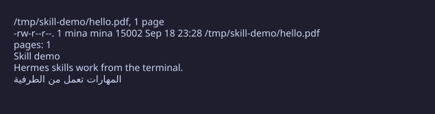

# agent-skills

  

## Why install this

This is a pack of 12 skills for coding agents like Hermes: each one is a single
markdown file the agent loads only when a task matches it. When it doesn't
match, the body never enters the context window, so the pack costs nothing
until it earns its place. Every skill documents work actually done on the
author's Fedora Atomic machine, including the error strings and version
pitfalls that turn up along the way. If you run a similar setup, the shortcuts
are already written down.

## What is in the box

| Skill | What you get |
|---|---|
| `custom-llm-provider-setup` | Point your agent at any OpenAI-compatible endpoint (Ollama, vLLM, LM Studio, Workers AI) without guesswork |
| `device-connectivity` | Pair your phone with a Linux desktop over KDE Connect and move files between them |
| `flatpak-browser-open-html` | Open local HTML files in a flatpak browser, and understand why plain `flatpak run` drops file URLs |
| `hermes-browser-fedora-atomic` | Get the agent's browser working again on Fedora Atomic / bootc when it breaks |
| `hermes-desktop-customization` | Patch the desktop app's fonts and titlebar without breaking updates |
| `hermes-web-tools` | Understand which backend the web search and extract tools pick, and what to fix when they fail |
| `marker-pdf` | Scanned PDFs, Arabic and RTL included, converted to clean markdown with OCR corrected afterwards |
| `pdf-creation` | Produce Unicode-safe PDFs with fpdf2, including crossed-out text, when reportlab is not an option |
| `single-gpu-passthrough` | Hand your only GPU to a Windows VM and back again, with libvirt hooks tuned for Fedora bootc |
| `starship-prompt` | A working Starship prompt setup across bash, zsh and Fish, with the TOML traps already handled |
| `subtitle-download` | Fill in missing subtitles for a whole movie library in one pass, under Podman |
| `zed-hermes-acp` | Wire the agent into the Zed editor via the Agent Client Protocol, Flatpak included |

## Install

Copy the skill folders into wherever your agent keeps them. On Hermes Agent,
each folder goes under `~/.hermes/skills/<name>/` (a category subfolder also
works), and you load a skill by name with the skill-view tool. Any agent that
follows the same `SKILL.md` convention reads these files the same way.

To look at a skill before installing it, read its `SKILL.md`: the description
in the frontmatter tells you when it fires, and the body is the procedure.
Browsing is just `cat skills/<name>/SKILL.md`.

## Proof it works

The validator checks the whole pack, and the test suite covers the same
checks. The banner at the top shows real output from real commands run in this repo.

## Spec

How the pack stays consistent: what the validator checks, what counts as
enough authorship for a skill to be included, the file format, the test
layout, and how to add a skill. All of that lives in [SPEC.md](SPEC.md).

## License

MIT-0. See `LICENSE`.
